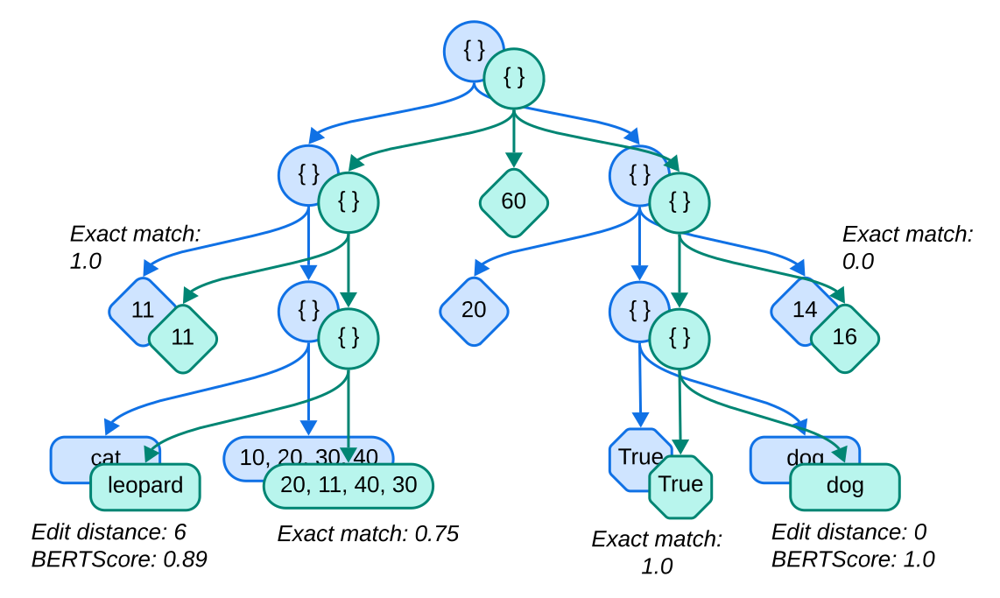

====================================
Conceptual guide of evaluating trees
====================================

This page details how treeval works conceptually.

Evaluating the leaf values of tree-based data
---------------------------------------------

Evaluating tree-based data, i.e. computing metrics between reference and hypothesis trees, can be tricky as the samples can feature complex structure and various types of data. No metric can reliably measure the similarity between two trees globally, and the popular metrics, for example measuring textual similarity, cannot perform accurately on whole trees as the structure syntax must be considered and children nodes must be evaluated in a permutation invariant way.

Treeval offers a flexible way to evaluate trees by working at the **leaf-level**, by computing several metrics between pairs of reference and hypothesis leaves. Doing so, **treeval computes a tree identical to the reference one with leaf values corresponding to the metrics results between reference and hypothesis leaves**. This offers a way to easily analyze results and interpret them at the leaf-level, but also to aggregate all of them to compute metrics averages, that can optionally be wrapped per leaf type.

   Two superposed trees being evaluated. Superposed nodes are assumed to have the same key not displayed here for ease of read. Circles are non-leaf nodes (dictionaries), other shapes are leaves of different types with diamonds being integers, rectangles being strings, octagons being booleans and rounded-sides rectangles being lists of integers. Some branches (including nodes and/or leaves) can mismatch, such as two integer leaves in this figure.

Treeval works with `dictionaries <https://en.wikipedia.org/wiki/Associative_array>`_, i.e. each node is identified by a unique key, and a value that can be a leaf or another dictionary (i.e. node with children). It is possible to use it with binary search trees, or any type of trees, by converting the nodes to Python dictionaries.

Tree structure and leaf types
---------------------------------

Treeval can work with any type of leaf. These can be the builtin Python types (integers, string...) or custom classes. When parsing a tree, Treeval follows a simple a rule: **all nodes are identified as leaves except if their types are dictionaries**. Doing so, nested dictionaries are recursively parsed until all their leaves have been explored. Below is an code example of a **schema description** of a tree, where the values describe the leaf types or child branch structure.

..  code-block:: python

    tree_schema = {
        "song_name": "string",
        "artist_name": "string",
        "song_duration_in_seconds": "integer",
        "has_lyrics": "boolean",
        "information": {
            "tempo": "integer",
            "time_signature": ["4/4", "4/2", "2/2"],  # one of the element within the list
            "key_signature": "string",
        },
        "instruments": ["string"],  # list of items of type "string"
    }

This example can be filled with data such as:

..  code-block:: python

    structured_data = {
        "song_name": "Wake Me Up Before You Go-Go",
        "artist_name": "Wham!",
        "song_duration_in_seconds": 231,
        "has_lyrics": True,
        "information": {
            "tempo": 81,
            "time_signature": "4/4",
            "key_signature": "C major",
        },
        "instruments": ["synthesizer", "bass guitar", "electric guitar", "drums"],
    }

Treeval computes metrics on leaves, between pairs of references and hypothesis trees. These computation can be **batched** when parsing multiple pairs of trees following the same schema, allowing to benefit from a faster runtime which can be crucial for deep-learning based metrics such as sequence similarity or LLM-as-a-judge methods. Additionally, treeval measures the **precision, recall and F1 scores at the tree-level** of the nodes in the hypothesis trees. Treeval has a specific way to handle lists which we describe in the next section.

Evaluation of lists of items
-----------------------------

When a leaf is a list of objects (that may be of any type, including dictionaries representing child branches), treeval does not consider the order of the elements within a reference and a hypothesis lists. In many cases, a list within a tree can be constructed in various orders, hence evaluating the elements pairwise can be irrelevant. Additionally, even when the construction of the list is supposed to follow a strict order, the predicted list might miss a few expected elements or contain unexpected elements, at any position, thus breaking a potential pairwise evaluation. Consequently, Treeval employs a **permutation-invariant** method.

Treeval computes the metrics scores on all the possible combinations of pairs of reference/hypothesis items within the lists, then computes the pairs of reference/hypothesis items that maximize the sum of all of their scores. This corresponds to a form of `assignment problem <https://en.wikipedia.org/wiki/Assignment_problem>`_ which can be solved by computing the maximum/minimum matching of a weighted bipartite graph. However, a leaf can be evaluated with several metrics which must all be considered when solving this assignment problem. These metrics can have different ranges of possible score values and different directions (lower or higher is better). Before computing the maximum matching, Treeval normalizes all metrics scores between 0 and 1, inverse "lower is better" scores and averages them. Doing so, all metrics are weighted equally. This procedure might however ignore the distributions of scores of individual metrics, thus resulting in metrics that might weight more or less than others in practice. If that is the case, you can "trick" the score normalization by storing different ``score_range`` bounds for specific metrics. More details can be read in :ref:`Metrics in Treeval`.

Finally, lists of dictionaries are evaluated with the same alignment method, except that **pairs of dictionaries are evaluated recursively** and that the leaves metrics scores are aggregated per metric before the normalization step.

Treeval uses scipy's `linear_sum_assignment <https://docs.scipy.org/doc/scipy/reference/generated/scipy.optimize.linear_sum_assignment.html>`_ method, based on the Hungarian algorithm, to compute the matching, as its `runtime is on par with the best performing implementations <https://github.com/berhane/LAP-solvers?tab=readme-ov-file#output>`_ and that the library is popular and well-maintained.
